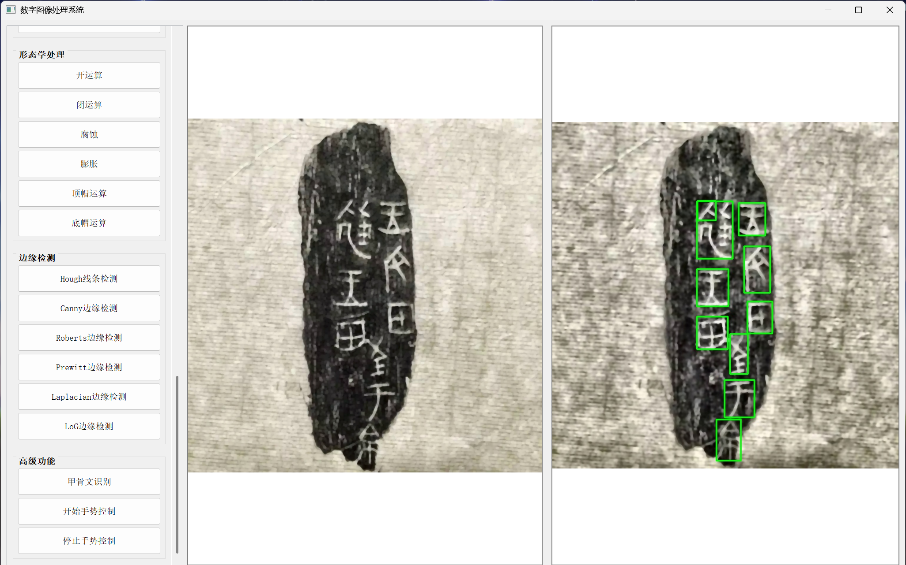
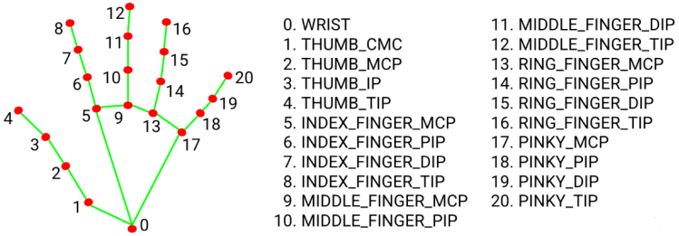

# 数字图像处理系统

## 概述 ℹ️

本数字图像处理系统是基于Python和PyQt5开发的综合性图像处理平台，采用YOLOv8深度学习框架实现高精度甲骨文识别，结合MediaPipe实现实时手势控制交互。系统整合了OpenCV、NumPy等核心计算机视觉库，构建了包含传统图像处理算法（如边缘检测、形态学操作等）与深度学习技术的混合处理流水线，具有跨平台、模块化、低延迟等技术特点，既可作为教学演示工具，也能满足实际工程应用需求。
## 功能特点 ✨

### 1. 基础操作 🛠️
- 图像加载和保存
- 灰度转换
- 二值化处理

### 2. 图像增强 🔍
- 图像增强
- 显示直方图
- 直方图均衡化

### 3. 噪声与平滑 🔊
- 椒盐噪声添加
- 均值平滑
- 中值平滑
- 高斯平滑

### 4. 图像锐化 🔪
- 拉普拉斯算子
- Sobel算子（水平和垂直方向）

### 5. 几何变换 📐
- 双线性插值放大
- 图像平移
- 旋转和缩放
- 仿射变换
- 透视变换

### 6. 颜色空间 🎨
- RGB转HSV
- HSV通道分离
- RGB通道分离

### 7. 形态学处理 ⚙️
- 开运算
- 闭运算
- 腐蚀
- 膨胀
- 顶帽运算
- 底帽运算

### 8. 边缘检测 ✂️
- Canny边缘检测
- Roberts算子
- Prewitt算子
- Laplacian算子
- LoG边缘检测
- Hough线条检测

### 9. 高级功能 🚀
#### 甲骨文识别
##### 操作方式
1. 上传所需要识别的甲骨文拓片
2. 点击甲骨文识别即可


#### 手势控制


##### 基本操作准备
1. **硬件要求**：
    - 需配备普通摄像头（支持640x480分辨率即可）
    - 操作环境应有基本照明，避免完全黑暗
    - 建议操作距离为摄像头前40-60厘米
2. **启动方式**：
    - 运行程序后自动开启默认摄像头
    - 画面中将显示紫色矩形控制区域
    - 左上角显示实时帧率(FPS)

##### 支持的手势操作
**鼠标移动控制**
- **激活方式**：伸直食指
- **特性**：
    - 食指指尖位置映射到屏幕坐标
    - 自动平滑处理移动轨迹
    - 移动速度与手移动幅度成正比

 **鼠标左键点击**
- **手势**：拇指与食指根部贴合（图中点4和点5）

 **鼠标右键点击**
- **手势**：食指伸直+中指弯曲
- **判定条件**：
    - 中指弯曲程度>阈值
    - 食指保持伸直状态
- **延迟**：无额外操作延迟

 **页面滚动控制**
- **向下滚动**：
    - 手势：同时弯曲食指和中指
    - 间隔：每0.5秒触发一次

- **向上滚动**：
    - 手势：同时弯曲无名指和小指
    - 间隔：每0.5秒触发一次
##### 使用提示
1. 手掌应完全进入识别区域
2. 手势变换时应保持明确停顿
3. 复杂背景可能影响识别精度
4. 帧率低于20FPS时建议优化光照条件
##### 注意事项
⚠️ 仅支持单手操作  
⚠️ 手势需保持至少1秒才能稳定识别  
⚠️ 系统不包含拖拽、缩放等高级手势功能

## 安装说明 ⚙️

1. 确保已安装Python 3.8

2. 安装依赖：
   ```bash
   pip install -r requirements.txt
   ```

## 运行说明 ▶️

### 本地部署开发模式 

1. 确保已安装Python 3.8环境
2. 克隆项目仓库到本地
3. 安装依赖库：
```bash
pip install -r requirements.txt
```

4. 运行主程序：
```bash
python main_code/main.py
```
### 直接使用软件包 

1. 项目提供打包好的软件安装包
2. 在Release中下载发布的DIPsetup.exe安装包
3. 双击运行安装程序，按照向导完成安装
4. 在开始菜单或桌面找到"DIP"快捷方式，双击运行即可启动应用程序

### 注意事项 

1. 本地部署需要配置Python3.8环境
2. 软件包版本无需安装Python环境
3. 两种运行方式功能完全一致

## 使用说明 📖

1. 点击"打开图像"按钮加载要处理的图像
2. 选择需要的处理功能
3. 根据提示设置相关参数
4. 处理结果会实时显示在右侧
5. 可以点击"保存图像"按钮保存处理结果
6. 甲骨文识别功能中，直接使用原始图像进行识别即可

## 注意事项 ⚠️

1. 确保系统有足够的内存和处理能力
2. 建议使用分辨率不超过4K的图像
3. 手势控制功能需要摄像头支持

## 系统要求 💻

- 操作系统：Windows 10/11, macOS, Linux
- Python版本：3.8

## 文件结构 📁

```text
main_code/
├── gesture_control.py 
├── image_processor.py 
├── main.py 
├── oracle_recognition.py 
└── ui_mainwindow.py 

models/
└── detection-fp32.onnx 
└── detection-fp16.onnx 


docs/                       
├── images/                 
│   ├── OracleDetect.png
│   └── Handpoints.png

resources/
├── test001.jpg
├── test002.jpg
├── test003.jpg
├── test004.jpg
└── test005.jpg

result/ 
README.md 
requirements.txt 
DIP_Setup.exe
```

## 本系统使用以下技术栈：
### 甲骨文识别技术栈 
#### 核心模型架构 

- **YOLOv8** (Ultralytics版本)
    - Backbone: CSPDarknet53
    - Neck: PANet
    - Head: Decoupled Head
- 模型格式: ONNX (FP32精度)
#### 图像处理
- OpenCV：用于图像预处理和后处理
- NumPy：数值计算和矩阵操作

### 手势控制技术栈 
#### 核心框架
- MediaPipe：谷歌开源的多媒体机器学习框架
- OpenCV：实时视频处理
#### 关键技术
1. **手部检测**：
	- 基于BlazePalm的实时手部检测
	- 21个手部关键点定位
2. **手势识别**：
    - 关键点空间关系分析
    - 动态手势轨迹追踪
    - 支持多种预定义手势

### 共同技术基础
- Python 3.8 运行时环境
- PyQt5 图形界面框架
- 跨平台支持 (Windows/macOS/Linux)

## 参考开源代码 📚
https://github.com/Lucas-CX/GestureInteraction
https://github.com/LIU42/OracleRecognition
